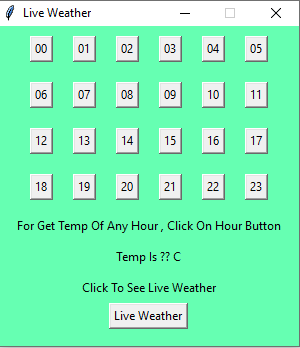

<h1 dir="rtl" >اپلیکیشن هواشناسی با پایتون</h1>

این پروژه دمای تهران را در ساعت های مختلف به شما نشان میدهد 

جهت استفاده از این برنامه ریپازیتوری را کلون یا دانلود کرده 

سپس به فولدر dist بروید و فایل index.exe اجرا نمایید

